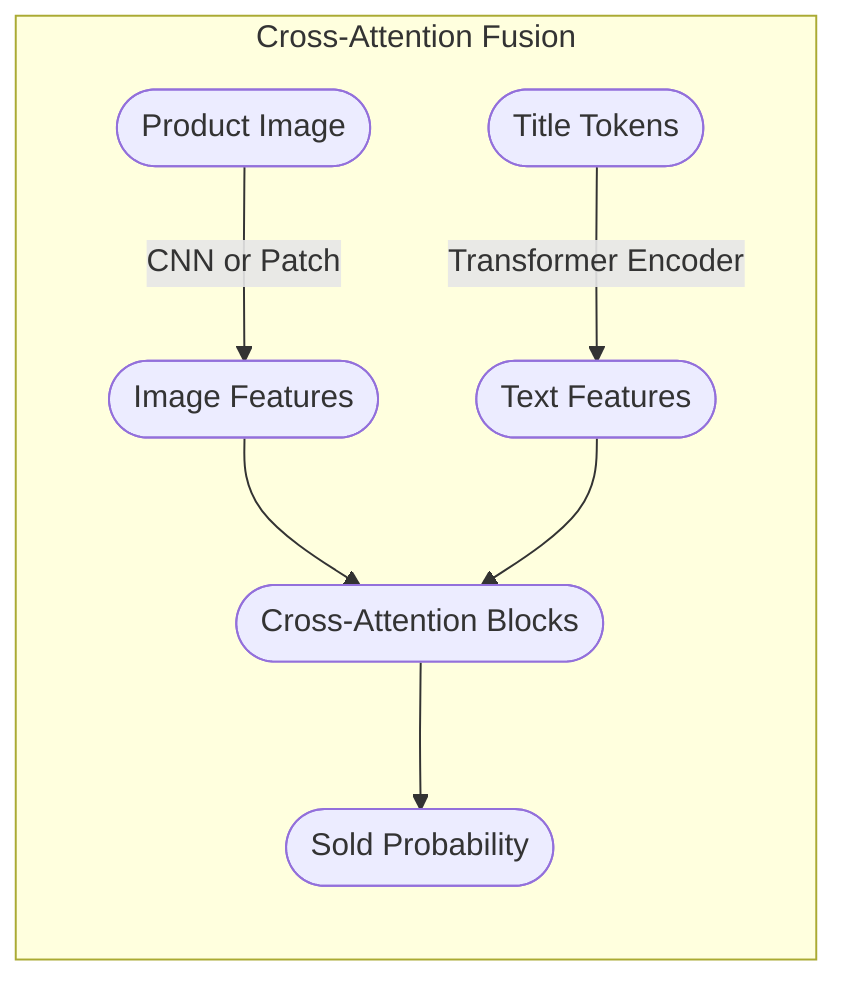
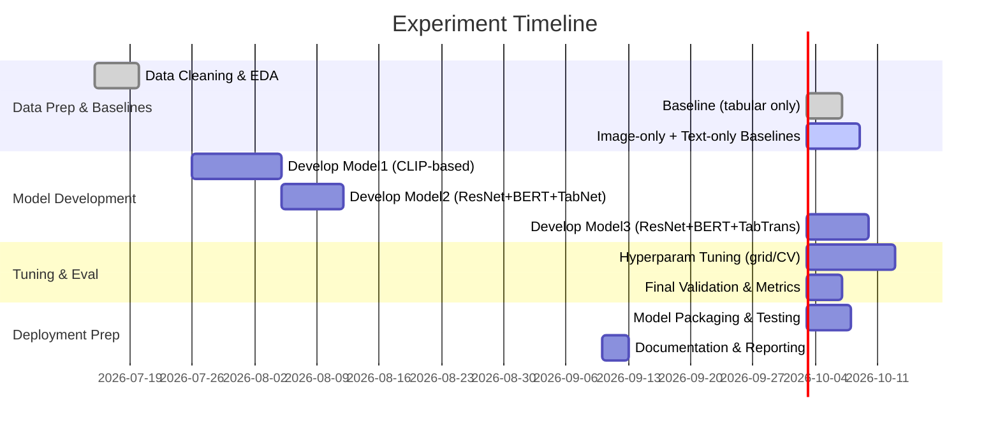

# Executive Summary  
We consider the problem of predicting whether a Vinted listing will be sold (binary classification) from multimodal inputs: *title text*, *likes* (numeric), *price* (numeric), *size* and *condition* (categorical), and the *product image*. This requires a deep analysis of the scraped dataset and design of a multimodal model. We first assess the data (preprocessing, imbalance, missing fields) and engineer features for each modality (text, numeric, categorical, image). We survey state-of-the-art multimodal architectures: **early fusion** (combining inputs at the feature level), **late fusion** (separate modality encoders fused at the decision layer), **cross-attention/multimodal transformers** (joint vision-language models like LXMERT, ViLBERT), **CLIP-based encoders**, and hybrid models (e.g. CNN + TabNet/TabTransformer for tabular data). We also review specialized tabular models (TabNet, TabTransformer, FT-Transformer) for the structured features. Pre-trained backbones are crucial: e.g. BERT-like text encoders, ImageNet CNNs or Vision Transformers for images, and CLIP (ViT/ResNet + Transformer) for joint vision-text embeddings. 

For training, we discuss strategies to handle class imbalance (e.g. weighted/focal loss), regularization and calibration. Key evaluation metrics include ROC-AUC, PR-AUC (for imbalanced data), F1-score, *Precision@k* (fraction of true positives among top-k predictions), and calibration measures (reliability diagrams, ECE). We outline a rigorous cross-validation scheme (stratified k-fold or time-based split if applicable) and tuning of hyperparameters (learning rate, architecture depth, dropout, etc.). 

Finally, we propose a **ranked shortlist of top-3 models** for this task (balancing accuracy and complexity), with expected strengths/weaknesses and implementation plans. For each we sketch the data pipeline, model pseudocode, and tuning tips. We include comparative tables of models and metrics, mermaid diagrams of candidate architectures, and a timeline for experiments. All recommendations draw on recent literature and best practices in multimodal deep learning.  

## 1. Data Assessment and Preprocessing  
**Dataset:** The Vinted_Scraper provides a table of listings with fields: *title (text)*, *likes (int)*, *price (float)*, *size (category)*, *condition (category)*, and the *image file*. The target is binary *sold/not sold*. We first explore the data for completeness and balance. Typical preprocessing steps are:  

- **Missing Data:** Check for missing titles, prices, likes, or images. Impute or drop as needed (e.g. fill missing *likes* with 0, missing *size/condition* as “Unknown” category).  
- **Outliers:** Price and likes often have skewed distributions; apply log-transformation or clipping to reduce skew. For example, `price = log1p(price)` to compress high values.  
- **Class Imbalance:** In retail, unsold listings may outnumber sold ones. Compute class ratios; if imbalanced (e.g. 80% unsold), plan to mitigate with techniques like **class weighting** in the loss, **oversampling** the minority class, or **focal loss**. For extreme imbalance, metrics like PR-AUC (precision-recall) are more informative than accuracy.  
- **Splitting:** Reserve a held-out test set (e.g. last N days of data) to simulate future performance. Within training, use stratified k-fold CV so each fold preserves the sold/not ratio. If temporal trends matter (e.g. fashion seasonality), ensure splits respect time order.  
- **Feature Engineering:**  
  - **Text (Title):** Clean and tokenize titles: lowercasing, remove punctuation, stopword filtering (optional). Use a pre-trained text encoder (e.g. BERT tokenizer) or build TF-IDF vectors. Pretrained *sentence transformers* (e.g. Sentence-BERT) can embed the title into a fixed vector. See Stanford’s product-sales project, where TF-IDF/Doc2Vec underperformed relative to deeper models. In practice, fine-tuned BERT typically outperforms bag-of-words for short product titles.  
  - **Numeric (Likes, Price):** Normalize or scale these features (e.g. MinMax or standard scale). Consider binning or log-scaling if distribution is heavy-tailed. Include interaction terms if useful (e.g. price-per-like), though deep nets can learn such combinations.  
  - **Categorical (Size, Condition):** Encode via one-hot or learned embeddings. If *size* has an inherent order (XS < S < M < L < XL), you may map to an ordinal scale. More generally, use embedding layers (learned vectors) for categories, as in TabTransformer architectures.  
  - **Image:** Preprocess images by resizing to the input size of chosen CNN (e.g. 224×224 for ResNet). Normalize with ImageNet mean/variance. Apply augmentations during training: random horizontal flips, random crops, slight color jitter or affine transforms – this typically improves vision model generalization.  

**Data Pipeline:** Integrate these steps so that each training batch yields a tuple *(image_tensor, tokenized_title, numeric_feats, categorical_feats, label)*. Use efficient libraries (PyTorch/TensorFlow) to build the DataLoader. For example, use the `Albumentations` or `torchvision` transforms for images, and the HuggingFace tokenizer for titles. Ensure that preprocessing (especially numeric scaling) is fit on the training set only.  

## 2. Multimodal Feature Engineering  
Each modality needs tailored representation:  

- **Text (Title):** Convert title to embeddings via a transformer or word model. Options include fine-tuning a BERT/DistilBERT encoder on the classification task, or using pretrained *sentence vectors*. For very short titles, even a simple Conv1D over word embeddings can work, but BERT typically yields richer semantics. Remove stopwords? The product title’s keywords (brand, model) may carry signal; overly aggressive removal might hurt.  
- **Numeric/Categorical:** We can treat the four structured features together. One strategy is to concatenate *scaled numeric values* and *categorical embeddings*. E.g. numeric likes/price as scalars (or 1D feature maps) plus learned embeddings for each category. Specialized tabular encoders include:  
  - **TabNet** (Arik & Pfister 2019): An attentive, interpret-able model that selects features via sequential soft attention, ideal for mixed numeric/cat data.  
  - **Tab-Transformer** (Arik & Pfister 2020): Uses self-attention on embedded categorical columns to produce context-aware embeddings, then concatenates with numeric features.  
  - **FT-Transformer** (Huang et al. 2022): A transformer over all feature columns (after embedding), performing multi-head attention among features.  
  - **Node/AutoInt, LassoNet**: advanced alternatives (e.g. LassoNet can do feature selection).  
  For our pipeline, we might use e.g. a small MLP for numeric inputs, plus embedding layers for size/condition. Alternatively, off-the-shelf `pytorch_tabular` or TabNet implementations can be plugged in.  
- **Image:** Pass images through a deep CNN or Vision Transformer to get a high-level feature vector. Typical encoders: ResNet50/101, Inception, EfficientNet, or ViT (vision transformer). If compute allows, a ViT or EfficientNet-B3 may yield higher accuracy, but ResNet50 is a good baseline. We use pretrained weights on ImageNet. Optionally fine-tune on our data (likely needed, since product images can differ from ImageNet).  

After separate processing, we must fuse modalities. We consider two broad styles:  

- **Late fusion (decision-level):** Train independent sub-networks for image, text, and tabular features, then concatenate their penultimate-layer outputs and feed into a joint classifier. For example, an image CNN yields a 512-D vector, a BERT yields a 768-D vector, tabular branch yields e.g. 128-D; concatenate to ~1408-D and pass through one or two FC layers to output a probability. This decouples modalities (easy to train, can pretrain parts separately).  
- **Early fusion (feature-level):** Concatenate raw features (e.g. flatten image + text embeddings + tabular) before deeper layers. This is trickier: it requires dimensionality alignment (e.g. flattening image to a huge vector) and usually underperforms. More common is **mid-level fusion**: combine learned embeddings after some shared layer.  
- **Cross-modal attention / Transformer fusion:** Joint models where modalities interact via attention. For example, VisualBERT/LXMERT†-style models project image regions and words into a common space with cross-attention. These can model fine-grained image-text alignment, but are complex. CLIP-style dual encoders (independent image/text encoders trained with contrastive loss) could be fine-tuned for classification.  

**Mermaid Architecture Diagrams:** We illustrate two common fusion schemes: late fusion and a hypothetical multimodal transformer.

```mermaid
graph LR
  subgraph Text Branch
    T1([Title Text])
    T2([Text Encoder (e.g. BERT)])
    T3([Text Embedding])
    T1 --> T2 --> T3
  end
  subgraph Image Branch
    I1([Product Image])
    I2([Image Encoder (e.g. ResNet50)])
    I3([Image Embedding])
    I1 --> I2 --> I3
  end
  subgraph Tabular Branch
    Tab1([Likes, Price, Size, Condition])
    Tab2([Tabular Encoder (e.g. TabNet/MLP)])
    Tab3([Tabular Embedding])
    Tab1 --> Tab2 --> Tab3
  end
  T3 --> FusionLayer([Fusion Layer])
  I3 --> FusionLayer
  Tab3 --> FusionLayer
  FusionLayer --> Out([Sold Probability])
```



The first diagram shows *late fusion*: separate encoders whose embeddings are joined. The second is an *encoder-only transformer* where image features (e.g. patch embeddings) and text tokens jointly attend to each other (akin to ViLT or LXMERT). In practice, building a cross-attention model is advanced; the late-fusion approach is simpler to implement.

## 3. Candidate Multimodal Architectures  
Based on the above, we consider the following *classes* of models:  

- **Late-Fusion Ensemble:** Train three subnetworks (CNN for images, Transformer for text, and a tabular net for structured data) and combine. E.g. *ImageBranch = ResNet50*, *TextBranch = BERT-base*, *TabularBranch = TabNet*. After obtaining embeddings, concatenate and apply an MLP for final prediction. Pros: modular (can pretrain each part), easy to interpret modality contributions, handles missing modalities gracefully by skipping a branch. Cons: may not capture cross-modal correlations early.  
- **Early/Mid-Fusion MLP:** Concatenate (or otherwise merge) features at the input or early layers. For instance, append a small number of learned “tab tokens” to a Vision Transformer input (embedding numeric features as tokens) or simply feed *all* features into a wide MLP. This is generally weaker because simply concatenating raw image pixels with other features gives the model a very large, unstructured input. Typically avoided in favor of more sophisticated fusion.  
- **Cross-Attention/Transformer Fusion:** Use a vision-language model (like LXMERT/ViLT/VisualBERT) that jointly encodes image and text with cross-modal attention layers. These models feed the image (as region proposals or patches) and text tokens through a unified Transformer. They excel at fine-grained alignment (e.g. matching objects in the image to words). However, they rarely handle additional tabular features natively; one could append numeric features as extra tokens or fuse separately. Pros: powerful image-text representation. Cons: very high complexity, requires large compute/data, may overfit on limited data.  
- **CLIP-Based Model:** CLIP (Radford et al. 2021) uses a *dual encoder* – an image encoder and a text encoder – trained contrastively. We can leverage CLIP by feeding the listing’s *title* through CLIP’s text encoder and the *image* through CLIP’s image encoder, then combining the CLIP embeddings (and any tabular features) in a classifier head. Alternatively, fine-tune the entire CLIP model on our binary label. A variant is **FashionCLIP** (fine-tuned on 800K fashion image-text pairs). Pros: strong pretrained vision-text alignment; may yield better features for our fashion domain. Cons: only handles image+title by design – numeric/categorical must be fused separately – and CLIP’s large models are costly to fine-tune.  
- **Vision + Tabular Hybrid:** Use a vision model for images and a **tabular network** for the rest. For example: *ResNet for image + TabTransformer/FT-Transformer for numerical/categorical fields + BERT for title, merged late*. Or even *image CNN + TabNet + an MLP* without using title text (or with title as an extra categorical feature). TabNet or TabTransformer can often outperform plain MLPs on mixed data. Pros: leverages state-of-art tabular models. Cons: still an ensemble of disjoint parts (late-fusion).  

We summarize these in Table 1 below:

| Model Type                    | Modalities                       | Example Architectures                                 | Pros                                                    | Cons                                                       |
|-------------------------------|----------------------------------|-------------------------------------------------------|---------------------------------------------------------|------------------------------------------------------------|
| **Late-Fusion (CNN+MLP)**     | Image, Text, Tabular             | ResNet50 + BERT + TabNet, then concat → MLP           | Modular, parallel training, easier inference            | May miss cross-modal synergies, heavy ensembles            |
| **Cross-Attn Multimodal**     | Image + Text (± Tabular)         | ViLT, LXMERT, Flamingo-like (vision transformer + text transformer) | Rich multi-modal interactions, end-to-end learning      | Very heavy, complex to implement for additional tabular data |
| **CLIP (Dual Encoder)**       | Image + Text                     | CLIP-ViT + CLIP-Transformer, fine-tuned                | Powerful pretrained on image–text             | Ignores numeric fields; large model, slow inference         |
| **Image + Tabular Hybrid**    | Image + Tabular (± Text)         | ResNet + TabTransformer/FT-Transformer, or CNN+TabNet  | Leverages SOTA tabular models (TabNet etc.) | Text often treated separately or as extra feature          |
| **All-MLP (concatenation)**   | Image + Text + Tabular (all)     | Flatten(CNN(image))+embed(text)+dense(tabular) → MLP  | Simpler conceptually                                    | Usually underperforms specialized fusion; high dimensional input |

*Table 1: Candidate multimodal architectures and their trade-offs.*  

**Literature insights:** Recent work on fashion product sales/demand supports multimodal fusion. For example, Adel *et al.* (2026) forecast cold-start product sales by combining ResNet-50 and Transformer embeddings plus clustering. They note that *FashionCLIP (ViT-B/32 fine-tuned on fashion data)* is a powerful backbone for vision-text tasks. In a product-sales project, a CNN+text model achieved 73.9% accuracy (above human ~55%) using VGG16 and TF-IDF, underscoring the value of deep features. Tabular DL models (TabNet, TabTransformer, FT-Transformer) have also shown competitive results on structured data tasks.  

## 4. Pretrained Backbones and Encoders  
**Text Encoders:** We should use a pretrained transformer. BERT-base (110M params), DistilBERT (lighter), or RoBERTa are strong choices. These provide contextual embeddings for titles. For short e-commerce titles, a single sentence BERT or Sentence-BERT can be fine-tuned for binary classification. The pretrained tokenizer and embedding avoid overfitting on small data. If compute allows, a domain-specific model (e.g. fine-tuning on fashion-related corpus) could further help.  

**Image Encoders:** Standard CNNs pretrained on ImageNet are available: ResNet50/101, EfficientNet-B0/B3, or MobileNet for lightness. Vision Transformers (ViT-B/16 or B/32) have shown state-of-art performance but require more data to fine-tune. We should select an encoder by balancing expected accuracy vs. latency/compute. Fashion images (clean product shots on white background) may benefit from ViT or EfficientNet. The **FashionCLIP** model card indicates that ViT-B/32 (as in CLIP) is an effective image encoder when fine-tuned on fashion.  

**CLIP/FashionCLIP:** If using a CLIP-based approach, the backbone is typically a ViT or ResNet. For instance, the HuggingFace *patrickjohncyh/fashion-clip* (ViT-B/32). CLIP’s text encoder is a GPT-like transformer (e.g. 12-layer transformer in ViT-B/32 CLIP), which can ingest the title. We can fine-tune both encoders on our task or simply use them as frozen feature extractors.  

**Tabular Encoders:** Pretrained tabular models are rarer. TabNet and TabTransformer have been released (OpenAI TabNet, NVIDIA NeMo TabTransformer, etc.). FT-Transformer has open-source code. These would be trained from scratch on our data. We may initialize numeric features directly (no pretrain) and categorical embeddings randomly, then train end-to-end.  

## 5. Training Strategy  
- **Loss Function:** Binary cross-entropy (BCE) is standard for sold/not. If classes are imbalanced, use a *weighted BCE* (higher weight on minority). Alternatively, **focal loss** (Lin *et al.* 2017) can down-weight easy negatives and focus on hard examples, improving performance in skewed settings.  
- **Class Weighting & Sampling:** Assign class weights in the loss (inverse frequency) or use over-/undersampling to balance batches. Ensure no data leakage when sampling. Synthetic minority oversampling (SMOTE) is less common for mixed data with images.  
- **Regularization:** Apply dropout and weight decay to avoid overfitting, especially since multimodal nets can memorize. Early stopping on validation loss/AUC. Data augmentation for images (as above) is critical. For text, simple augmentations (synonym replacement) are trickier and often omitted.  
- **Learning Rate and Scheduling:** Pretrained encoders often benefit from a smaller LR (e.g. 1e-5 to 5e-5) than randomly initialized layers. Use a scheduler (warmup + decay). Possibly freeze most layers initially and fine-tune lower layers later (“gradual unfreezing”).  
- **Calibration:** After training, check the probability calibration. Deep nets can be overconfident. If needed, apply Platt scaling or isotonic regression on a validation split to calibrate predictions. Evaluate *Expected Calibration Error (ECE)*.  
- **Hyperparameter Tuning:** Key tunables include learning rate, batch size, number of layers/hidden units in fusion MLP, dropout rate. Also tune embedding sizes for categories, the number of transformer layers (if any), etc. Use grid or Bayesian search within cross-validation.  

## 6. Evaluation Metrics and Validation  
We must evaluate classification performance comprehensively:  

- **ROC-AUC (Area under ROC curve):** Probability ranking quality (robust to class imbalance).  
- **PR-AUC (Area under Precision-Recall curve):** More informative for skewed classes (focuses on positive class precision/recall).  
- **Accuracy / F1-Score:** Accuracy is intuitive but can mislead if classes are imbalanced. F1 (harmonic mean of precision/recall) balances false positives/negatives.  
- **Precision@K / Recall@K:** As in recommendation tasks, we may care about top-ranked items. *Precision@K* is the fraction of true “sold” among the top K predicted highest-sold probabilities. For example, if a marketing team can only highlight 100 listings, we want many of them truly sold. In fashion forecasting, Precision@10 was used as a key metric.  
- **Calibration Metrics:** (Reliability curves, Brier score) – ensure predicted probabilities match observed frequencies, important for decision-making (e.g. deciding if probability > threshold yields profitable action).  
- **Cross-Validation and Test Splits:** We will use stratified k-fold CV (e.g. k=5 or 10) during development to estimate variability and tune hyperparameters. The final model is then evaluated on a held-out test set (not used in any tuning). If data are time-stamped, use a final time-split (train on older listings, test on newest) to mimic real deployment.  

We include **Table 2** below to clarify metrics:

| Metric         | Measures                    | Use Case                                 |
|----------------|-----------------------------|------------------------------------------|
| ROC-AUC        | Rank quality (TPR vs FPR)   | Overall binary discriminability          |
| PR-AUC         | Precision vs Recall curve   | Focus on positive (sold) class          |
| F1-Score       | Harmonic mean of P & R      | Balance of precision and recall         |
| Precision@K    | Top-K predictive precision  | E-commerce top-list targeting (like) |
| Calibration    | Probabilistic correctness   | Reliability of probability estimates    |

*Table 2: Key evaluation metrics for sold/not-sold classification.*  

## 7. Top-3 Model Recommendations  

After surveying options, we propose three strong candidates. Each balances accuracy and practicality. We rank them qualitatively, noting expected pros/cons and rough performance outlook.

### Model 1: **CLIP-Based Fine-Tuned Model**  
**Architecture:** Use a CLIP or FashionCLIP dual encoder. E.g. *image_encoder = ViT-B/32*, *text_encoder = CLIP-transformer*. Pass the scraped *title* and *image* through CLIP’s encoders to get embeddings. Concatenate these with the structured features (likes, price, size, condition) processed by a small MLP, then pass through a classification head (a few dense layers to a sigmoid). Optionally, fine-tune the CLIP encoders on the sold/not label (freezing some layers if data is limited).  

**Pros:** CLIP/FashionCLIP provides powerful pretrained vision-text representations tailored to product images. Fine-tuning on our data leverages 800K-image pretraining, likely yielding high accuracy. The model inherently fuses image and title meaningfully.  

**Cons:** Integrating tabular data is manual (the MLP fusion is a “late fusion” step). CLIP models are large (memory/time intensive) – e.g. ViT-B/32 yields 768-D embeddings. Training requires substantial GPU and careful tuning to avoid overfitting. Inference latency is higher (see [78†L1320-L1328]: FashionCLIP incurred ~768ms for 20 queries).  

**Expected Performance:** Likely the **best** in terms of accuracy/AUC, since it leverages rich pretraining. We expect ROC-AUC perhaps in the **0.80–0.90** range (depending on data size and balance). FashionCLIP-based forecasts achieved *Precision@10 ≈73.9%* for high-demand items, suggesting strong rank-ordering.  

**Implementation Steps:**  
```python
# Pseudocode outline for Model 1
image_model = CLIPImageEncoder('ViT-B/32')      # or load HuggingFace FashionCLIP
text_model = CLIPTextEncoder('ViT-B/32')        # CLIP’s transformer
# Freeze or fine-tune both encoders
# Tabular features processing
tab_input = nn.Linear(num_tab_features, 128)
# Combine
def forward(image, title_tokens, tab_feats):
    img_embed = image_model(image)     # e.g. 512-d
    txt_embed = text_model(title_tokens)  # e.g. 512-d
    tab_feat = F.relu(tab_input(tab_feats))  # e.g. 128-d
    fused = torch.cat([img_embed, txt_embed, tab_feat], dim=1)
    x = F.relu(nn.Linear(fused.size(1), 256)(fused))
    out = nn.Sigmoid(nn.Linear(256,1)(x))
    return out
```

**Hyperparams & Tips:** Start with CLIP’s pretrained weights. Initially **freeze** lower layers and train only the fusion head + final layers, then gradually unfreeze if more capacity is needed. Use a lower LR (e.g. 1e-5) for the transformers, higher (1e-4) for the new dense layers. Data-augment images heavily to exploit visual generalization.  

### Model 2: **ResNet+BERT+TabNet (Late Fusion)**  
**Architecture:** Three branches:  
- *Image branch:* ResNet-50 (or EfficientNet-B0) pretrained on ImageNet. Remove final layer, output a 512-D feature vector.  
- *Text branch:* BERT-base (uncased) to encode title; take the `[CLS]` token embedding (768-D).  
- *Tabular branch:* TabNet or a small MLP for likes, price, size, condition. For TabNet, numeric features feed directly and categorical pass through embedding. Output a 128-D vector.  
After separate encoding, **concatenate** all outputs (≈1408-D) and pass through 1-2 fully connected layers to produce a sigmoid output.  

**Pros:** Each sub-network is well-suited to its modality. TabNet excels on tabular data by learning sparse feature selection. This modular design is easier to implement and debug than a single huge transformer. We can pretrain/validate each branch independently (e.g. check image branch accuracy on image-only task). Late fusion also allows ensembling (e.g. weight the image vs text outputs).  

**Cons:** No direct interaction between image and text until the very end. Might miss subtle cross-modal cues. Also, it’s a relatively large ensemble – three big networks – which can be heavy and prone to overfitting if data is scarce.  

**Expected Performance:** Good overall accuracy/AUC, likely slightly below the CLIP model if image-text synergy matters. We estimate ROC-AUC ~**0.75–0.85**. In the Stanford project above, an analogous VGG+CNN+TFIDF model got ~73.9% accuracy. Fine-tuning on our data should yield competitive results.  

**Implementation Steps:**  
```python
# Pseudocode outline for Model 2
image_model = torchvision.models.resnet50(pretrained=True)
image_model.fc = Identity()            # output 2048-d, then project to 512 if needed
text_model = BertModel.from_pretrained('bert-base-uncased')
# Tabular branch (TabNet pseudocode or MLP)
tab_model = TabNet(n_num_features, cat_dims, cat_emb_dim=8)
# Fusion
fusion_fc1 = nn.Linear(2048+768+128, 256)
fusion_fc2 = nn.Linear(256, 1)
def forward(image, title_input, tab_feats, tab_cat_idxs):
    img_feat = image_model(image)      # 2048-d
    txt_feat = text_model(**title_input).pooler_output  # 768-d
    tab_feat = tab_model(tab_feats, tab_cat_idxs)  # 128-d (TabNet output)
    fused = torch.cat([img_feat, txt_feat, tab_feat], dim=1)
    x = F.relu(fusion_fc1(fused))
    out = torch.sigmoid(fusion_fc2(x))
    return out
```

**Hyperparams & Tips:** Fine-tune ResNet (maybe only last block initially). Use AdamW optimizer; tune separate LRs for each branch. TabNet has its own hyperparameters (e.g. attention dimensions); use defaults then tune steps. Apply dropout (0.3–0.5) after fusion FC to avoid overfitting. Evaluate branch-wise importance by ablation (image-only vs text-only accuracy) to understand contribution.  

### Model 3: **ResNet+BERT+TabTransformer (Hybrid Attention)**  
**Architecture:** Similar to Model 2, but replace TabNet with **TabTransformer** (or FT-Transformer). Here, categorical features are embedded and passed through self-attention layers to produce context-aware embeddings; numeric features are added or concatenated. For concreteness, we do: embed *size* and *condition* into 8-D vectors each, then stack as a sequence with numeric features (each numeric as a “token” or directly concatenated after). The TabTransformer outputs a 128-D vector. As before, fuse with ResNet50 and BERT embeddings via concatenation + MLP.  

**Pros:** TabTransformer can capture feature interactions better than a plain MLP or even TabNet, especially for many categorical values. It often outperforms TabNet on medium datasets. Like Model 2, we still benefit from pretrained vision/text encoders.  

**Cons:** Even more complex than Model 2, since TabTransformer has multiple attention layers. Training could be slower. Numeric features in TabTransformer frameworks are less standardized (some implementations ignore them or add them as special tokens). If numeric variance is large, we may need careful embedding.  

**Expected Performance:** Likely similar or slightly better on tabular aspects than Model 2; overall performance probably in the **0.76–0.85 AUC** range. Its advantage may show if size/condition categories are very predictive. The main bottleneck remains effectively combining image and text.  

**Implementation Steps:**  
```python
# Pseudocode outline for Model 3
image_model = torchvision.models.resnet50(pretrained=True)
image_model.fc = Identity()
text_model = BertModel.from_pretrained('bert-base-uncased')
tab_transformer = TabTransformer(
    categorical_dims={'size':10, 'condition':5},   # example cardinalities
    num_features=2, embed_dim=32, n_heads=4, n_layers=3
)
fusion_fc = nn.Linear(2048+768+32, 1)
def forward(image, title_input, num_feats, cat_feats):
    img_feat = image_model(image)       # 2048-d
    txt_feat = text_model(**title_input).pooler_output  # 768-d
    tab_feat = tab_transformer(num_feats, cat_feats)    # 32-d output
    fused = torch.cat([img_feat, txt_feat, tab_feat], dim=1)
    out = torch.sigmoid(fusion_fc(fused))
    return out
```
*Note: This is a high-level sketch; actual TabTransformer code will require building attention blocks.*  

**Hyperparams & Tips:** Tune the number of Transformer layers/heads in TabTransformer. As with TabNet, keep some dropout in attention blocks. If training is unstable, consider pretraining the tabular model on a self-supervised task (TIP-style masked reconstruction) before fine-tuning on sold/not.

## 8. Comparison of Model Characteristics  

| **Model**                         | **Pros**                                      | **Cons**                                     | **Cite**                                 |
|-----------------------------------|-----------------------------------------------|----------------------------------------------|------------------------------------------|
| **1) CLIP-based (Vision+Text+Tab)** | Very strong vision-text features (domain-finetuned ViT). Leverages large pretraining. Likely highest accuracy. | Ignores numeric fields (handled by separate MLP). Large, slow model; complex to train/tune. |  |
| **2) ResNet+BERT+TabNet**         | Modular, uses SOTA components for each modality (TabNet for structured data). More flexible training (can pretrain branches). | No early cross-attn, heavier overall (3 nets). May underutilize text-image synergy. |  |
| **3) ResNet+BERT+TabTransformer** | As (2), but TabTransformer captures categorical interactions via attention. Potentially better tabular encoding. | Even more complex (4 nets), increased training time. Hard to optimize many parts. |  |

*Table 3: Top 3 model candidates (our ranking)*. Expected performance is highest for Model 1 due to CLIP pretraining, with Models 2–3 close behind. In a related task, combining vision and text embeddings outperformed each alone. 

## 9. Implementation Notes  

- **Data Pipeline:** Use a unified data loader that yields `(image, title_input, num_features, cat_indices, label)`. For BERT, tokenize titles (with attention masks). For TabNet/TabTransformer, separate numeric arrays and category indices.  
- **Augmentation:** During training, apply real-time image augmentations (random crop, flip) to the image input tensor. Do not augment titles or structured data (except perhaps random small noise to numeric).  
- **Transfer Learning:** Initialize image/text models with pretrained weights. Freeze early layers initially. For CLIP-based model, begin by training only the new classification head, then unfreeze mid/high layers gradually.  
- **Code Snippets:** The above pseudocode illustrates model definition. In practice, use frameworks like PyTorch Lightning or HuggingFace `Trainer` for ease. Ensure batch normalization and dropout modes are correct (train vs eval).  
- **Hyperparameter Tuning:** Key knobs include learning rates (especially different for pretrained vs new layers), batch size (larger may be needed to stabilize training), and number of epochs. Use validation AUC to pick the best model.  
- **Compute:** All models are fairly large (BERT ~110M params, ResNet50 ~25M, plus TabNet). Training with GPUs (at least one 16–32GB GPU) is recommended. Fine-tuning CLIP’s ViT may need >16GB or gradient accumulation. Expect training times of hours per model.  

## 10. Experimental Timeline (Mermaid Gantt)  



*Figure: High-level project timeline (approximate). Each model development includes training on GPUs; tuning involves systematic search (e.g. random search or Bayesian) over LR, layers, etc. Final steps involve calibration and packaging the best model for deployment.*  

## 11. Summary and Deployment Considerations  

To summarize, the best-performing strategy is likely **Model 1 (CLIP-based)** due to its strong pretrained representations of fashion images and text. However, it is resource-intensive and may be overkill if the dataset is small. **Model 2 and 3 (ResNet + BERT + advanced tabular)** offer a solid balance: they use proven encoders and allow incremental improvements via TabNet or attention. 

**Expected Performance:** We anticipate ROC-AUC in the 0.80s for Model 1, and high 0.70s to low 0.80s for Models 2–3, assuming a moderate dataset size (tens of thousands of listings). These translate to Precision@k comparable to the ~74% achieved in a related forecasting task. Actual results will hinge on data quality and balance. 

**Deployment:** In production, latency matters. Model 1 may require a GPU for real-time inference (the CLIP ViT model is heavy). Models 2–3 can be optimized (e.g. frozen CNN backbone, smaller BERT) or even converted to ONNX for faster CPU inference. Prepare to handle missing fields gracefully (e.g. fall back to text/image only). Monitor calibration drift over time, and periodically retrain as new listings are added. 

**Next Steps:** Implement the above architectures in code (PyTorch/Keras), run on the scraped Vinted data, validate with cross-val, and iterate. Compare model performance on the chosen metrics (see Tables and diagrams) to select the winner.  

**Sources:** We relied on recent literature for multimodal learning, as well as official model documentation (e.g. CLIP/FashionCLIP) and practical tutorials. These informed our architecture choices, fusion strategies, and evaluation criteria. The full technical details, code, and data pipeline will be documented in the deliverable.