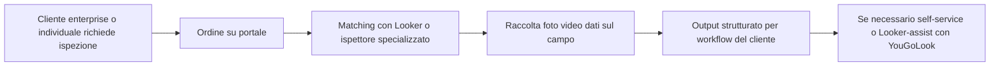
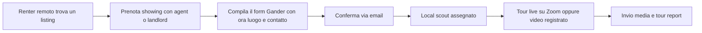
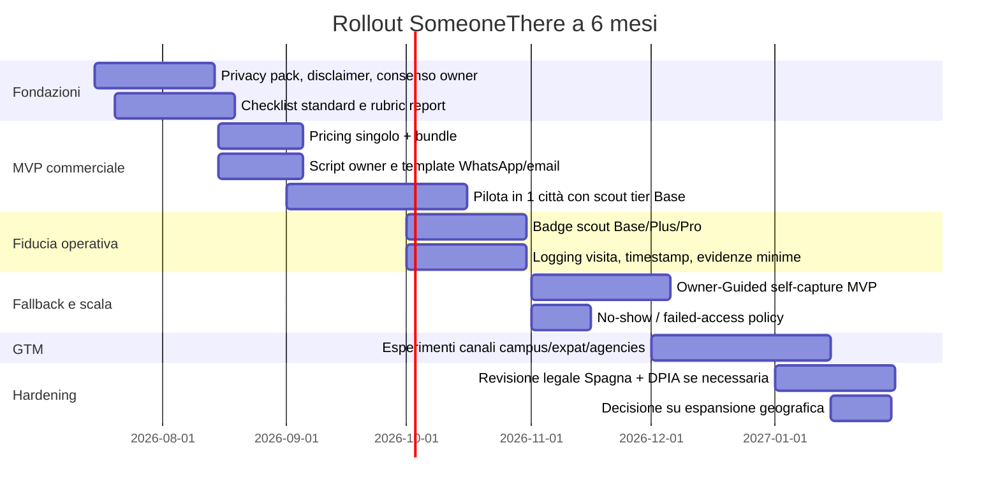

# Analisi comparativa di WeGoLook e Gander per SomeoneThere

## Sommario esecutivo

Tra i due benchmark, **Gander** è il riferimento più vicino a SomeoneThere sul piano dell’esperienza utente: parte dal bisogno del renter remoto, si posiziona come soggetto indipendente rispetto a broker e landlord, usa un flusso semplice in quattro passaggi, offre tour live via Zoom o video registrato, produce un tour report e monetizza in modo trasparente con pricing self-service e bundle. Il suo punto forte è la chiarezza del valore percepito per studenti, expat, remote renters e piccoli investitori; il suo limite principale è che il modello pubblico appare poco strutturato sul fronte compliance, privacy documentata, vetting avanzato dei local scout e owner-consent formalizzato. citeturn3view1turn5view0turn6view2turn40view1

**WeGoLook**, invece, non è un concorrente diretto di SomeoneThere lato “remote apartment tour”, ma è un benchmark molto utile lato **operations, trust infrastructure e scalability**. Oggi è integrato nell’ecosistema Crawford, opera come piattaforma on-demand per ispezioni e raccolta dati, dichiara una rete di oltre 45.000 “Lookers”, distingue tra servizi standard, self-service e custom solutions, e combina workflow mobile, geolocalizzazione, logging, reti professionali differenziate e modelli ibridi con assistenza sul campo. Il suo insegnamento più importante per SomeoneThere è che il vero vantaggio competitivo non è solo “chi va a visitare la casa”, ma **come si standardizzano prova, affidabilità, escalation, fallback e trattamento dei dati**. citeturn55view0turn36view2turn43view2turn50view1

Per SomeoneThere, la sintesi operativa è questa: **adotta il front-end semplice e buyer-centric di Gander, ma costruisci il back-end di fiducia e controllo alla WeGoLook**. In pratica: owner-consent scritto e modulare, default “live senza registrazione”, report strutturato con checklist e severità dei rilievi, local scout vetting a livelli, metadata ed evidenze minime verificabili, fallback self-service per host/owner che non accettano terzi, e pricing a pacchetti. Questo combinato aumenterebbe conversione, accettazione dei proprietari e difendibilità legale del servizio. citeturn5view0turn6view2turn50view1turn53view3turn28view0turn31view1turn31view2

## Metodo e limiti

Questo report privilegia **fonti primarie e ufficiali**: siti corporate, pagine prodotto, termini, privacy notice, pagine di onboarding, blog ufficiali, oltre a fonti normative ufficiali spagnole ed europee per la sezione compliance. Per il sentiment e il feedback esterno, nel caso di Gander è stato possibile integrare un articolo originale di **Curbed/New York Magazine**; per WeGoLook, nelle fonti pubbliche direttamente accessibili il materiale è molto più sbilanciato su contenuti corporate e contrattuali, coerentemente con un posizionamento prevalentemente B2B/claims. Dove un dettaglio non è emerso in modo affidabile dalle fonti consultate, è indicato come **“non specificato”**. citeturn3view0turn35view0turn51view0turn5view2

Va anche notato che il pricing di Gander è cambiato nel tempo: nel marzo 2024 il blog ufficiale citava **$49 per tour** e **$100 per bundle da tre**, mentre la pagina di booking pubblica consultata nel luglio 2026 espone **$75 per il tour renter**, **$149 per investor tour**, **$199 per bundle renter** e **$375 per bundle investor**. Questo non è un problema: è anzi un segnale utile di iterazione commerciale e di possibile aumento della willingness-to-pay. citeturn48view1turn5view0

## Profili aziendali e posizionamento

| Voce | WeGoLook | Gander |
|---|---|---|
| Fondazione | **Non specificato** nelle pagine ufficiali consultate; l’asset attuale è presentato come piattaforma proprietaria Crawford e integrato nell’offerta Alternative Inspections. citeturn36view2turn55view0 | Il sito dichiara attività “**Since 2021**” e la fondatrice Grace Kim spiega di aver creato Gander dopo la propria esperienza di house-hunting a New York. citeturn3view1turn6view0 |
| Sede / base operativa | Contatti e termini indicano **5335 Triangle Parkway NW, Peachtree Corners, Georgia**; il brand è collegato a Crawford Inspection Services / Crawford & Company. citeturn55view1turn9view1 | Il sito è focalizzato su **NYC**; la founder page colloca Grace Kim a **New York | Hell’s Kitchen**. Sede legale dettagliata: **non specificato** nelle pagine consultate. citeturn6view0turn3view1 |
| Team size | Employee team pubblico: **non specificato**. Rete operativa dichiarata: **45.000+ Lookers**. citeturn55view0turn36view1 | Team size complessivo: **non specificato**. Il sito mostra una rete di “locals” e una pagina “Meet the Locals”, con espansione dichiarata in più quartieri, città e stati. citeturn6view1 |
| Funding | **Non specificato** nelle fonti primarie consultate. | **Non specificato** nelle fonti primarie consultate. |
| Business model | Piattaforma on-demand di ispezioni e raccolta dati per imprese e individui, con tre linee: **Standard Looks**, **Self-Service Looks**, **Custom Solutions**; forte focus enterprise e claims/inspection workflows. citeturn55view0turn36view2 | Servizio D2C a pagamento per **remote renters** e **investors**, con tour effettuati da locals indipendenti, media capture, check-list, report, pricing per visita e bundle. citeturn5view0turn40view1turn6view2 |
| Clienti target | Financial services, auto & fleet, construction, insurance, più use case custom; lato consumer viene citata la “buying confidence”, ma il core è aziendale/operativo. citeturn55view0turn35view0 | Out-of-state renters, international renters, studenti, interns e investors; il sito cita centinaia di utenti aiutati da 13+ Paesi e 7+ college. citeturn3view1turn40view1 |

Sul piano del **market positioning**, Gander occupa una nicchia molto chiara: “**third-party apartment tours for remote renters**”, con enfasi su indipendenza, onestà del tour e anti-scam utility. Il suo messaggio è consumer-first: “We don’t sell. We show.” e “Your eyes and ears on the ground.” WeGoLook, al contrario, comunica risk reduction, data gathering, distributed workforce e process efficiency: è molto più vicino a una **infrastructure company** per inspection ops che a un servizio di apartment touring. citeturn3view1turn55view0turn36view2

Per SomeoneThere questo significa che i due modelli non vanno letti come “chi è il competitor più simile?”, ma come **due metà complementari della stessa soluzione**: Gander insegna come vendere la promessa al renter; WeGoLook insegna come trasformare quella promessa in un sistema scalabile, verificabile e governabile. citeturn3view1turn36view2turn50view1

## Analisi prodotto dettagliata

### WeGoLook

Sul piano del prodotto, WeGoLook dichiara tre famiglie di offerta. **Standard Looks** servono per inviare velocemente un “Looker” a raccogliere e validare informazioni; **Self-Service Looks** permettono di far raccogliere dati ai propri clienti o dipendenti; **Custom Solutions** portano workflow end-to-end integrati nei processi del cliente. È un disegno modulare molto importante: non solo marketplace di operatori, ma layer di orchestrazione tra lavoro sul campo, raccolta dati e integrazione nei sistemi del cliente. citeturn55view0

L’onboarding lato field force è esplicito: i professionisti si iscrivono come **independent contractor**, con professioni differenziate quali **Looker**, **Looker-Notary**, **Roof Inspector** e **Interior/Exterior Inspector**. I requisiti impliciti crescono con la specializzazione: il notary richiede licenza notarile; i roof e interior/exterior inspectors sono descritti come professionisti esperti e usano smartphone e photo technology per catturare dati sul campo. Questo suggerisce una logica di **tiering della rete**, molto rilevante per SomeoneThere. citeturn43view2turn8view1

Il flusso utente pubblico di WeGoLook, ricostruibile dalle fonti consultate, appare più simile a un workflow inspection che a un remote tour sincrono: il cliente ordina o richiede ispezione, la piattaforma assegna la risorsa appropriata, l’operatore raccoglie foto/video/dati, e l’output torna nel sistema. La presenza di **placeorder.wegolook.com**, del portale di onboarding, di app mobili e dell’integrazione con Google Geo-Location conferma un’architettura operativa centrata su job dispatching e field capture, non su call live con renter finale. Alcuni dettagli di booking e pricing pubblico non risultano accessibili senza JavaScript o login, dunque vanno marcati come **non specificato**. citeturn37view0turn55view1turn43view3

Un tassello particolarmente interessante è **YouGoLook**, il prodotto self-service di Crawford collegato a WeGoLook. Qui il flusso è chiarissimo: l’utente finale usa il proprio smartphone, segue istruzioni step-by-step, carica immagini/informazioni; i dati sono geotaggati e marcati con data/ora; le informazioni sono trasmesse in modo sicuro; le foto non restano sul device; e se l’utente non completa correttamente il task, la rete WeGoLook può intervenire con un **“Looker-assist”** in presenza. Questo è probabilmente il pattern più prezioso per SomeoneThere quando il proprietario rifiuta l’accesso a un terzo ma sarebbe disposto ad aprire a una modalità self-capture o assisted capture. citeturn50view1turn49view0

Lato privacy e responsabilità, WeGoLook/Crawford è molto più maturo di Gander. I termini pubblici indicano mobile apps, uso di Google Geo-Location Services, disclaimer “as is”, assenza di garanzie e limitazioni di responsabilità. La privacy notice globale Crawford afferma inoltre che, in molti casi, Crawford agisce come **vendor / data processor / service provider** per clienti primari, dettaglia categorie di dati raccolti — incluse registrazioni audio/video, device info e geolocation data — e dichiara finalità quali identity verification, fraud prevention, customer care e sicurezza. Questo non risolve da solo tutti i rischi, ma mostra un livello di formalizzazione molto superiore. citeturn55view1turn52view1turn52view4turn53view3

| Aspetto prodotto | WeGoLook |
|---|---|
| Core features | Ispezioni on-demand, foto/video/data capture, workforce dispatching, servizi standard/self-service/custom, reti professionali differenziate. citeturn55view0turn36view2turn43view2 |
| Booking | Portale ordine dedicato **placeorder.wegolook.com**; dettagli pubblici di form e pricing non specificati. citeturn37view0turn36view2 |
| Onboarding verifier | Independent contractor signup; profili Looker, Notary, Roof Inspector, Interior/Exterior Inspector. citeturn43view2 |
| Owner consent | **Non specificato** pubblicamente nelle pagine consultate; dipende dal tipo di ispezione e dal committente. |
| Live visit | Non è il focus pubblico del prodotto core; più centrale la raccolta asincrona di evidenze e dati. citeturn55view0turn36view2 |
| Reporting | Evidenze strutturate, immagini/dati raccolti, output per claims/inspection workflows; formato pubblico dettagliato non specificato. citeturn36view2turn50view1 |
| Pricing | Pubblico non specificato. La value proposition è price/speed/innovation, ma senza listino aperto. citeturn55view0 |
| Tech stack discoverable | Mobile apps, Google Geo-Location Services, order portal, onboarding portal, support portal; architettura completa non specificata. citeturn55view1turn43view3turn37view0 |
| Privacy / recording | Policy e termini pubblici, geolocation notice, audio/video/geolocation categories, security/fraud-prevention language. citeturn55view1turn52view1turn52view4 |
| ID / verification | Identity verification richiamata nella privacy notice; meccanismi concreti pubblici non specificati. citeturn52view1 |
| Insurance / liability | Warranties molto limitate e robusta limitation of liability; coperture assicurative specifiche non specificate. citeturn53view3turn53view4 |
| Partnerships | Integrazione forte con Crawford/AIS; altre partnership specifiche non dettagliate nelle pagine consultate. citeturn35view0turn36view2 |

Il diagramma sopra sintetizza il flusso pubblico ricostruibile dalle fonti ufficiali consultate; la presenza del ramo **self-service + assist** è documentata soprattutto nella pagina YouGoLook. citeturn36view2turn50view1

### Gander

Il prodotto Gander è molto più vicino all’esperienza che SomeoneThere vuole costruire. La homepage pubblica racconta la value proposition in una frase: **tour non filtrati di appartamenti a NYC, filmati da residenti locali, per dare una vista onesta e indipendente a chi non può visitare di persona**. Il brand è costruito sulla terzietà rispetto alla transazione immobiliare: Gander insiste di non essere affiliata a landlord, broker o agenti e di non avere incentivi a “vendere” l’immobile. citeturn3view1turn40view1

Il flusso operativo di Gander è semplice e molto pulito. L’utente deve prima **schedulare lui stesso la showing con listing agent o management company**; poi compila il booking form di Gander con orario, luogo e contatto del proprietario/agente; riceve una conferma; infine un local scout va sul posto, filma e invia contenuti, oppure gestisce un live tour via Zoom. Questo è un approccio cruciale: Gander **esternalizza il problema del consenso e dell’accesso** al rapporto tra utente e agente/owner, anziché farsene carico con un proprio layer procedurale. È semplice, ma lascia spazio a fragilità operative e legali. citeturn3view1turn40view1turn6view2

La breakdown delle feature è sorprendentemente solida per un prodotto leggero. Il piano “Renters” promette walkthrough spaziale non tagliato, verifica di layout, viste, spazio armadi, “invisible metrics” come rumore, odori e luce naturale, red flags come water stains e maintenance issues, più verifica che gli elettrodomestici e le feature corrispondano all’annuncio. Il sito elenca anche ciò che i tour mostrano: pulizia generale, odore/rumore, macchie d’acqua, elettrodomestici, spazio armadi, climatizzazione/riscaldamento, pressione dell’acqua e drenaggio, luce naturale e amenities. Il blog ufficiale aggiunge che l’utente riceve un **tour report** con dettagli sull’unità e sull’edificio. citeturn5view0turn6view2turn48view0

Il pricing attuale pubblico è molto leggibile: **$75 renter tour**, **$149 investor tour**, **$199 renter bundle da 3** e **$375 investor bundle da 3**. La FAQ aggiunge una policy di cancellazione con full refund fino a due ore prima, **$25 cancellation fee** oltre quella soglia e **$25 no-show fee** se il local non ottiene accesso, ad esempio perché l’agente non si presenta. Il confronto con il blog del marzo 2024, che citava $49 e $100, suggerisce che Gander ha testato e poi alzato il prezzo, probabilmente dopo aver validato domanda e unit economics. citeturn5view0turn4view3turn48view1

Sul lato “verifier onboarding”, Gander comunica una rete di locals con familiarità di quartiere, side-hustle appeal, espansione geografica e **“quick vetting process”**, ma specifica anche che **non è necessaria precedente esperienza di tour**. Questo è un punto delicato: buono per scalare in fretta, meno buono se vuoi posizionarti su affidabilità quasi ispettiva. SomeoneThere qui può differenziarsi con livelli di credentialing più espliciti. citeturn6view1

Sul piano privacy/compliance, Gander pubblica un disclaimer chiaro ma leggero: i media riflettono la condizione visiva del bene solo al momento della registrazione; Gander è un servizio indipendente di media/data capture; non è broker, agente, appraiser o home inspector; i contenuti sono informativi e senza garanzie. Nelle pagine pubbliche consultate non emergono invece una privacy policy o termini facilmente accessibili come footer standard. Anche questo è un importante spazio competitivo per SomeoneThere. citeturn3view1turn40view0turn40view2turn40view3

| Aspetto prodotto | Gander |
|---|---|
| Core features | Tour di appartamenti “unfiltered”, live Zoom o video registrato, checklist di ispezione, local guides indipendenti, tour report. citeturn3view1turn6view2turn48view0 |
| Booking | L’utente prenota prima la showing con agent/landlord; poi invia su Gander indirizzo, ora e contatto del proprietario/agente. citeturn3view1turn40view1 |
| Onboarding verifier | Network di locals, quick vetting process, nessuna esperienza tour pregressa necessaria, familiarità col quartiere richiesta. citeturn6view1 |
| Owner consent | Gestito a monte tramite la showing organizzata dall’utente con listing agent/owner; layer di consenso documentato da Gander: non specificato. citeturn3view1turn40view1 |
| Live visit | Zoom link per tour live; in alternativa video registrato inviato via email. citeturn6view2 |
| Reporting | Tour report con dettagli su unità ed edificio; checklist e osservazioni su acqua, luce, view, amenities, rumore, odori, macchie. citeturn6view2turn5view0turn48view0 |
| Pricing | $75 renter, $149 investor, $199 renter bundle, $375 investor bundle; in marzo 2024 il blog citava $49 e $100 bundle. citeturn5view0turn48view1 |
| Tech stack discoverable | Zoom per live, Calendly per booking, Vimeo per contenuti video; stack completo non specificato. citeturn6view2turn5view0turn3view1 |
| Privacy / recording | Registra e invia media; disclaimer chiaro su ruolo e limiti; privacy policy/terms pubblici non emersi nelle pagine consultate. citeturn3view1turn40view0turn40view2 |
| ID / verification | Quick vetting process dei locals; controlli ID/background pubblici non specificati. citeturn6view1 |
| Insurance / liability | Disclaimer forte; coperture assicurative specifiche non specificate. citeturn3view1turn5view0 |
| Partnerships | Nessuna partnership formale chiaramente esposta; il sito parla di 7+ college e 13+ Paesi serviti, ma non di accordi strutturati. citeturn3view1 |

Questo flusso deriva direttamente dalle FAQ e dal blog ufficiale Gander. citeturn3view1turn6view2

## Feedback utenti e confronto competitivo

Per **Gander**, le fonti consultate mostrano un pattern coerente di apprezzamento: gli utenti lodano la capacità di vedere l’appartamento in modo “unedited”, la verifica di aspetti non visibili nell’annuncio, la riduzione del rischio scam, il valore del controllo su acqua, luce, view e neighborhood, e il risparmio rispetto a viaggi fisici o broker costosi. Questi segnali emergono sia dalle testimonianze del sito sia dal reportage di Curbed, che descrive l’esperienza di seguire da remoto un apartment tour via Zoom controllando outlet, luce e pressione dell’acqua. citeturn40view1turn4view1turn5view2

La critica più utile, ancora su Gander, viene proprio da Curbed: il servizio risolve il problema della visita remota, ma **non sostituisce competenze legali o tenant-rights expertise**, e non protegge da tutte le pratiche aggressive del mercato immobiliare. In altre parole, Gander riduce l’asimmetria informativa fisica, ma non quella regolatoria o contrattuale. Questa è una lezione importante per SomeoneThere: il tuo servizio non deve promettere più di quanto può realmente verificare. citeturn5view2

Per **WeGoLook**, le fonti direttamente accessibili nel perimetro consultato non offrono un corpus robusto di recensioni consumer stile App Store / Trustpilot / Reddit comparabile a Gander; il materiale pubblico è dominato da pagine corporate, onboarding, privacy e termini, coerente con una proposta centrata su enterprise inspections e gig workforce. Per questo, qualsiasi giudizio sul sentiment di WeGoLook andrebbe fatto con cautela: il segnale più chiaro non è “gli utenti dicono X”, ma “l’azienda si presenta come infrastruttura B2B ad alta affidabilità e controllo operativo”. citeturn55view0turn36view2turn43view2turn51view0

### Tabella comparativa sintetica

| Criterio | WeGoLook | Gander | Implicazione per SomeoneThere |
|---|---|---|---|
| Vicinanza al caso d’uso SomeoneThere | Bassa-moderata: ispezioni/data capture, non apartment touring puro. citeturn55view0turn36view2 | Alta: remote apartment tour per renter e investor. citeturn3view1turn6view2 | Copiare Gander sul front-end di valore. |
| Maturità operativa | Alta su rete, dispatching, specializzazione, self-service assistito. citeturn43view2turn50view1 | Media: ottimo flow, meno rigore documentato su process e compliance. citeturn6view1turn40view1 | Copiare WeGoLook sul back-end operativo. |
| Trasparenza pricing | Bassa pubblicamente. citeturn55view0 | Alta pubblicamente. citeturn5view0turn48view1 | SomeoneThere dovrebbe mostrare prezzi chiari. |
| Fiducia / proof layer | Forte su geotag, data/time stamp, secure transmission, device non-retention, processor model. citeturn50view1turn52view1 | Forte su indipendenza percepita, debole su proof-of-process pubblico. citeturn40view1turn3view1 | SomeoneThere deve unire indipendenza + evidenza verificabile. |
| Owner-consent process | Non pubblico. | Esternalizzato al renter/agent. citeturn40view1 | Qui SomeoneThere può differenziarsi molto. |
| Bundle / monetizzazione | Non visibile. | Single + bundle + ramo investor. citeturn5view0turn48view1 | Ottima leva per ARPU e retention. |

### DAFO comparativo

| Azienda | Punti di forza | Debolezze | Opportunità | Minacce |
|---|---|---|---|---|
| WeGoLook | Rete 45.000+, specializzazione per ruolo, architettura standard/self-service/custom, integrazione Crawford, geotag + secure transmission + assist model. citeturn36view1turn43view2turn50view1turn52view1 | Pricing pubblico opaco, distanza dal caso d’uso renter, owner-consent non leggibile pubblicamente, sentiment consumer poco visibile. citeturn55view0turn37view0 | Applicare la stessa infrastruttura a proptech, remote due diligence, landlord self-capture, agency workflows. citeturn50view1turn36view2 | Concorrenti più verticali e UX-first sul residential, resistenza normativa/privacy, commoditizzazione dell’on-demand fieldwork. citeturn53view3turn31view2 |
| Gander | Value proposition chiarissima, UX semplice, pricing leggibile, indipendenza credibile, report concreto, forte fit per studenti/expat/remote renters. citeturn3view1turn5view0turn6view2 | Compliance pubblica leggera, vetting locals poco strutturato, owner-consent non formalizzato, ambito geografico stretto, liability/insurance non dettagliate. citeturn6view1turn40view0turn40view2 | Espandere città, creare pacchetti con agenzie o università, upsell su neighborhood intel e anti-scam evidence. citeturn3view1turn6view1 | Imitazione rapida del format, rischio reputazionale da tour incompleti o contestazioni privacy, aspettative eccessive degli utenti. citeturn5view2turn3view1 |

## Raccomandazioni prioritarie per SomeoneThere

La miglior strategia per SomeoneThere è non copiare uno dei due modelli “in purezza”, ma costruire un ibrido. La tabella seguente ordina le iniziative per **impatto** e **difficoltà di implementazione**.

| Priorità | Iniziativa | Cosa adottare / migliorare | Perché funziona | Impatto | Difficoltà |
|---|---|---|---|---|---|
| Alta | **Layer formale di owner consent** | Modulo breve pre-visita con opzioni: live-only, live+recording, aree escluse, niente armadi/documenti/persone; firma digitale o check esplicito. | Gander semplifica ma esternalizza il consenso; SomeoneThere può trasformare un punto di frizione in un vantaggio competitivo e legale. citeturn40view1turn28view0turn31view0 | Molto alto | Media |
| Alta | **Default “live senza registrazione”** | Registrazione solo opt-in separato; altrimenti live call senza salvataggio e report testuale/fotografico minimale. | Riduce resistenza dei landlord e abbassa il rischio privacy in Spagna. citeturn28view0turn27view2turn29view0 | Molto alto | Bassa |
| Alta | **Report strutturato con checklist standard** | Sezioni fisse: layout, luce, rumore, odori, umidità/macchie, acqua/scarichi, armadi, area comune, coerenza con annuncio, red flags, domande all’agente. | Gander mostra che il valore reale è la verifica di dettagli “invisibili”; il report trasforma il tour in decision support. citeturn5view0turn6view2turn48view0 | Alto | Bassa |
| Alta | **Scout vetting a livelli** | Tier Base, Plus, Pro: identità verificata, esperienza sopralluoghi, training privacy, conoscenza quartiere, eventuale background professionale. | Gander è forte sul “local”, WeGoLook sul “rete professionale stratificata”: tu puoi unire entrambe le cose. citeturn6view1turn43view2 | Alto | Media |
| Alta | **Prova leggera ma verificabile** | Timestamp, geotag opzionale/consensato, check-in/check-out, log domande risposte, hash del report, foto selettive. | WeGoLook dimostra il valore della proof layer; serve senza trasformare SomeoneThere in home inspection regolata. citeturn50view1turn52view1 | Alto | Media |
| Media | **Fallback self-service per owner diffidenti** | Modalità “HostCapture”: il proprietario apre un link guidato e filma lui con checklist SomeoneThere; se vuole, uno scout fa assistenza remota. | È l’insight più forte preso da YouGoLook: se il terzo non può entrare, prova a far filmare il titolare con workflow guidato. citeturn50view1 | Alto | Media |
| Media | **Pricing chiaro con bundle e ramo investor/agency** | Prezzo singolo + bundle da 3 + pacchetto “investor / due diligence light” + “agency plan”. | Gander mostra che la chiarezza prezzo riduce attrito e i bundle aumentano ticket medio. citeturn5view0turn48view1 | Medio-alto | Bassa |
| Media | **No-show / failed access policy trasparente** | Rimborso parziale, fee di accesso fallito, reschedule semplice; template standard per agent/owner. | Gander rende esplicito il rischio operativo; farlo riduce dispute e migliora fiducia. citeturn4view3 | Medio | Bassa |
| Media | **Owner-facing value proposition** | Messaggio: “servizio breve, nessuna intermediazione, niente negoziazione, niente deposito, opzione no recording, decisione più rapida del tenant”. | Riduce la percezione di controllo ostile e sposta il frame su efficienza commerciale. Il tuo scambio precedente va in questa direzione. |
| Media | **Posizionamento legale rigoroso** | Dichiarare di non essere broker, agente, perito, home inspector; servizio di media/data capture informativo. | Gander usa bene questo disclaimer; SomeoneThere ne ha bisogno in modo ancora più strutturato. citeturn3view1turn5view0 | Alto | Bassa |

La raccomandazione più importante non è tecnica ma di **product architecture**: SomeoneThere dovrebbe prevedere tre modalità native, non una sola. **Modalità Live Companion**, per tour sincroni; **Modalità Report First**, per chi non può collegarsi in diretta; **Modalità Owner-Guided**, quando il proprietario non vuole estranei ma accetta un percorso guidato. Questa tripartizione replica in chiave residential il vantaggio di WeGoLook tra standard, self-service e custom, senza perdere la linearità UX di Gander. citeturn55view0turn50view1turn6view2

## Esperimenti, KPI e piano di rollout a sei mesi

### Esperimenti e KPI

| Esperimento | Variante A | Variante B | KPI principale | KPI secondari | Ipotesi |
|---|---|---|---|---|---|
| Script di presentazione al proprietario | “Tenant serio, visita breve, nessun costo” | “Default senza registrazione + consenso modulare” | Tasso di accettazione owner | Tempo medio di conferma, tasso cancellazioni | La leva privacy aumenterà l’accettazione più della leva “tenant serio”. |
| Modalità visita | Solo live | Live + report asincrono | Conversione booking→decisione | NPS, riacquisto, dispute | Il report strutturato aumenterà il valore percepito. |
| Pricing consumer | Prezzo singolo basso | Prezzo medio + bundle 3 visite | Conversion rate al checkout | ARPU, CAC payback | Bundle e prezzo medio possono aumentare margine senza distruggere conversione. |
| Credenziali scout | Badge “local verificato” | Badge a livelli Base/Plus/Pro | Tasso prenotazione | Owner acceptance, refund rate | Più credenziali pubbliche migliorano fiducia da entrambi i lati. |
| Consenso e recording | Registrazione consentita di default | No-recording di default, opt-in separato | Owner acceptance rate | Dispute, drop-off user | Il default no-recording ridurrà attrito e rischio. |
| Fallback operativo | Nessun fallback | Owner-Guided self-capture | Tasso di visite salvate dopo rifiuto owner | Cost per completed visit | Una quota rilevante dei rifiuti può essere recuperata. |
| Report design | Testo libero | Checklist con severità e foto ancorate | Decision confidence score | Time-to-decision, refund requests | Le strutture standard migliorano chiarezza e comparabilità. |
| Go-to-market | Direct-to-consumer | Campus/international relocation/agency lead gen | CAC | Activation rate, referral rate | Alcuni canali avranno fit molto superiore. |

I KPI “north star” che consiglierei per SomeoneThere sono cinque: **owner acceptance rate**, **completed visit rate**, **time-to-report**, **decision confidence score dopo la visita**, e **refund/dispute rate**. A questi aggiungerei due KPI strategici: **share of bookings in bundle** e **fallback salvage rate** — cioè quante visite “a rischio” riesci a chiudere grazie alla modalità owner-guided o report-first. Quei due indicatori misurano se stai costruendo un business resiliente o un semplice servizio manuale. L’importanza del fallback è fortemente suggerita dal pattern YouGoLook/Looker-assist. citeturn50view1

### Piano di rollout a sei mesi

La sequenza è intenzionale: prima costruire **consenso, report e pricing**, poi testare il **pilota**, poi aggiungere gli strati di **trust e fallback**, e solo dopo spingere su acquisition sofisticata. Gander dimostra che si può lanciare snelli; WeGoLook dimostra che per scalare serve infrastruttura. citeturn5view0turn6view2turn50view1turn36view2

## Rischi normativi in Spagna e mitigazioni consigliate

In Spagna, il primo punto da presidiare è il fatto che **immagini, voce, geolocalizzazione e altre informazioni identificabili rientrano nel trattamento di dati personali**, e che il trattamento fondato sul consenso richiede una manifestazione **libera, specifica, informata e inequivoca**. Inoltre, quando i dati sono raccolti presso l’interessato, esiste un preciso dovere di informazione. Per SomeoneThere questo significa che un generico “ok, potete entrare” non basta come base documentale se stai effettuando riprese, audio, registrazione o report contenenti dati personali. citeturn28view0turn29view4turn31view0

Il secondo punto è che l’ordinamento spagnolo tutela in modo molto forte la **intimità personale e familiare** e la **propria immagine**. La Ley Orgánica 1/1982 considera intromissione illegittima l’installazione o l’uso di mezzi di ascolto o filmazione idonei a registrare la vita intima delle persone; il Código Penal, all’articolo 197, sanziona l’uso di mezzi tecnici di ascolto, registrazione o riproduzione dell’immagine o del suono senza consenso per vulnerare la privacy altrui. Per una visita in un’abitazione privata questo non significa che ogni ripresa sia vietata, ma significa che SomeoneThere deve progettare il prodotto assumendo **il consenso esplicito come regola, non come optional**, soprattutto se l’immobile è occupato o se compaiono beni, documenti, persone o elementi della sfera privata. citeturn27view2turn28view5turn29view0

Il terzo punto è la governance del trattamento. Se SomeoneThere determina finalità e mezzi del trattamento, tenderà a essere **titolare del trattamento**; se agisce strettamente per conto di un’agenzia o di un altro titolare, serve il classico impianto da **encargado del tratamiento / processor** con contratto scritto, istruzioni, misure di sicurezza e regole sui sub-responsabili. Il GDPR e la LOPDGDD richiedono che il titolare scelga processor con garanzie sufficienti e che il rapporto sia disciplinato per iscritto; richiedono inoltre misure tecniche e organizzative adeguate al rischio. citeturn31view1turn29view3turn31view2

Una valutazione d’impatto sulla protezione dei dati (**DPIA**) non è automaticamente obbligatoria in ogni scenario SomeoneThere, ma il GDPR la rende rilevante quando il trattamento comporta probabilmente un alto rischio per i diritti e le libertà delle persone; la logica prudenziale suggerisce di verificare formalmente questo punto, specie se il servizio iniziasse a registrare sistematicamente video di abitazioni, conservare grandi volumi di media, usare scoring o automatismi, oppure operare su larga scala. citeturn31view3turn31view2

Le mitigazioni operative che raccomando sono quindi molto concrete:

| Rischio | Mitigazione consigliata | Base normativa / logica |
|---|---|---|
| Riprese non autorizzate in ambiente domestico | Owner consent scritto, più consenso dei soggetti visibili o esclusione delle loro immagini; niente riprese di documenti, persone, letti, medicine, effetti personali non necessari. | citeturn28view0turn27view2turn29view0 |
| Eccesso di dati raccolti | Default live-only; recording solo opt-in separato; checklist di minimizzazione; aree escluse configurabili. | citeturn28view0turn31view2 |
| Ambiguità sul ruolo legale del servizio | Disclaimer forte: non broker, non home inspector, non perito, non consulenza legale. | citeturn3view1turn5view0 |
| Trattamento per conto di agenzie/partner | Data processing agreement, istruzioni scritte, ruoli chiariti, regole su retention e sub-processors. | citeturn31view1turn29view3 |
| Sicurezza insufficiente dei media | Cifratura, access control, retention breve, cancellazione automatica, audit log, export controllato. | citeturn31view2turn50view1 |
| Contestazioni su accuratezza o affidamento | Report informativo con limiti del servizio, timestamp, “condition as observed at time of visit”, no warranties. | citeturn3view1turn53view3 |

La conclusione giuridico-operativa è netta: in Spagna SomeoneThere non dovrebbe mai posizionarsi come semplice “amico che va a vedere la casa al posto tuo”. Dovrebbe invece presentarsi come **servizio strutturato di media capture e sintesi informativa con regole chiare di consenso, minimizzazione, sicurezza e limiti di affidamento**. È il modo migliore per ridurre il rischio regolatorio e, allo stesso tempo, aumentare la fiducia dei proprietari. citeturn28view0turn31view1turn31view2turn27view2turn29view0