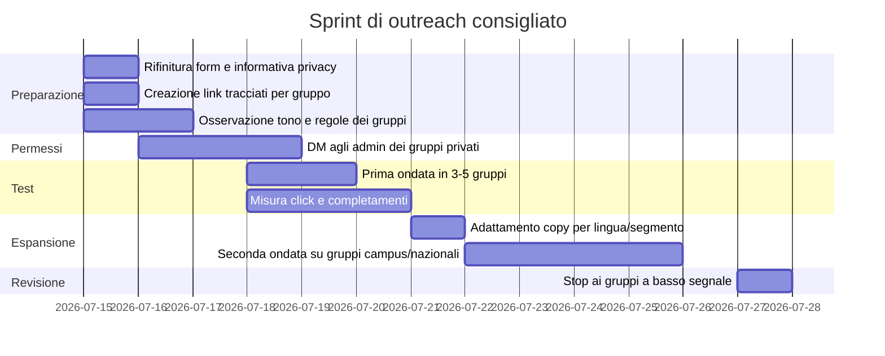

# Deep research sui gruppi Facebook per studenti internazionali diretti a Madrid

## Sintesi esecutiva

Ho individuato e deduplicato **oltre 30 URL/gruppi rilevanti**, concentrando la tabella prioritaria su **24 gruppi** che offrono il miglior compromesso tra pertinenza, attività osservabile, accessibilità pubblica e probabilità realistica di ottenere permesso di pubblicazione. I cluster più forti sono tre: **gruppi direttamente orientati a Madrid e agli studenti internazionali**, **gruppi universitari specifici**, e **community europee linguistiche/nazionali a Madrid**. Tra i segnali più forti pubblicamente verificabili spiccano **Student Housing in Madrid** con circa **4.5K membri**, **Madrid Expats Group - Internationals in Madrid** con circa **17K membri**, **Erasmus & International Students Madrid 2026/2027** con **2.775 membri**, **Italiani a Madrid** emerso in snippet Facebook con circa **34K membri**, e **Italiani a Madrid e dintorni** con **quasi 6.000 membri**. citeturn9search2turn9search5turn2search8turn27search3turn27search7turn13calculator0

La priorità operativa, dato che **non hai specificato il contenuto esatto del form né la funzione dell’app**, va data ai gruppi in cui gli utenti stanno già parlando di **arrivo a Madrid, alloggio, integrazione, Erasmus, università, lavoro/stage, lingua o vita studentesca**. Se la tua app è legata a housing, onboarding, social discovery, università, burocrazia o opportunità per studenti, i gruppi top sono già correttamente ordinati. Se invece l’app è un prodotto più commerciale o meno direttamente utile agli studenti in arrivo, alcuni gruppi scendono di priorità e diventa più importante scrivere prima agli admin. citeturn0search0turn4search13turn5search2turn18search2turn18search5

C’è però un limite metodologico importante: molti header e pannelli “About/Info” dei gruppi Facebook, aperti senza login, restituiscono schermate di login/blocco temporaneo oppure mostrano solo porzioni indicizzate; di conseguenza **conteggi, regole complete, lista admin/mod e data dell’ultimo post** non sono sempre verificabili pubblicamente. Nei casi non accessibili ho quindi marcato **n/v** e ho usato, dove possibile, **l’ultima attività indicizzata nei risultati pubblici** come proxy di recenza. citeturn1view0turn1view1turn1view2turn1view3turn1view4

La raccomandazione più robusta, sia per efficacia sia per conformità alle regole di Facebook e alla normativa privacy, è questa: **un solo post per gruppo, non ripetitivo, con tono peer-to-peer, chiara utilità per lo studente, disclosure trasparente sul form, e richiesta preventiva agli admin quando il gruppo è privato o le regole non sono visibili**. Facebook consente agli admin di imporre approvazione ai post e le linee guida ufficiali chiedono esplicitamente di evitare contenuti ripetitivi, contatti ripetuti e comportamenti assimilabili a spam. citeturn12search1turn12search8turn12search16turn12search24

## Metodo di ricerca e filtri

La ricerca è stata eseguita **sul web** e non tramite navigazione interna a Facebook, perché una quota rilevante dei gruppi mostra metadati pubblici solo attraverso le pagine indicizzate dai motori di ricerca o gli snippet di Facebook/Meta. Ho usato combinazioni di query mirate su `site:facebook.com/groups` con varianti linguistiche in **italiano, spagnolo, inglese, francese, tedesco, olandese e portoghese**, e con pattern tipici dei gruppi studenteschi come **“international students”, “Erasmus”, “Madrid”, “2026/2027”, “housing”, “roommate”, “language exchange”, “internships”, “students in Spain”**. Ho poi normalizzato i risultati eliminando duplicati vanity URL/ID e gruppi sostanzialmente sovrapposti. Un esempio di duplicazione emerso chiaramente è il titolo **“Erasmus & International Students Madrid 2026/2027”**, apparso sia con URL vanity sia con URL numerico. citeturn0search1turn5search17

Le tecniche di ricerca che hanno funzionato meglio sono state queste:

```text
site:facebook.com/groups "Madrid International Students"
site:facebook.com/groups "Erasmus" "Madrid" "2026/2027"
site:facebook.com/groups "estudiantes internacionales" "Madrid"
site:facebook.com/groups "Italiani a Madrid"
site:facebook.com/groups "Francais à Madrid"
site:facebook.com/groups "Deutsche in Madrid"
site:facebook.com/groups "Dutch students in Madrid"
site:facebook.com/groups "PORTUGUESES - TUGAS - EM MADRID"
site:facebook.com/groups "Work, Internships & Student Jobs Madrid"
site:facebook.com/groups "Intercambio de Idiomas Madrid"
site:facebook.com/groups "Study Abroad Spain"
```

Per far emergere campi altrimenti nascosti ho aggiunto parole chiave come:

```text
"Join group" "About this group" "Visible" "Only members can see who's in the group and what they post"
"Members." "recent post" "questions" "about" "info" "rules" "publicidad" "spam"
```

I filtri applicati sono stati quattro. Il primo è stato **la pertinenza geografica**: prima Madrid, poi Spagna, poi Europa/lingue europee con ponte naturale verso Madrid. Il secondo è stato **il contesto d’uso**: gruppi in cui le persone dichiarano esplicitamente che stanno arrivando a Madrid per studiare, fare Erasmus, cercare casa, tirocini, stage o eventi sociali. Il terzo è stata **la recenza pubblicamente osservabile**, cioè la presenza di post o discussioni indicizzate nel 2025-2026 o di snippet con segnali come “8h”, “5h”, “Apr 13”, “Jan 7”. Il quarto è stato **il rischio di frizione/moderazione**, privilegiando gruppi in cui la descrizione o il contesto fanno intuire un uso community-first più che commerciale. citeturn9search6turn21search12turn14search24turn15search27

La colonna “attività recente” nella tabella va letta con cautela: **non è sempre la data dell’ultimo post nel gruppo**, ma l’ultima attività **pubblicamente indicizzata** che sono riuscito a verificare senza chiedere accesso. Dove non c’era un segnale affidabile ho indicato **n/v**. Questo è coerente con il fatto che le aperture dirette di molti group header senza login mostrano solo schermate di blocco o metadati molto parziali. citeturn1view0turn1view1turn1view2turn1view3turn1view4

## Tavola prioritaria dei gruppi

**Legenda rapida:**  
**n/v** = non verificabile pubblicamente al **14 luglio 2026**.  
**Attività recente** = ultima attività **indicizzata pubblicamente**, non necessariamente l’ultimo post reale nel gruppo.  
**Approccio consigliato** = mia raccomandazione operativa, non un dato dichiarato dal gruppo.

| Priorità | Gruppo | URL | Focus geografico | Lingue | Pubblico / privato | Membri | Attività recente | Regole rilevanti per pubblicare | Contatto admin/mod | Approccio consigliato |
|---|---|---|---|---|---|---|---|---|---|---|
| A | **Student Housing in Madrid** citeturn4search13turn10search21 | `https://www.facebook.com/groups/studentroomsinmadrid/` | Madrid | EN | **Pubblico** citeturn9search6 | **4.5K** citeturn9search2 | **14 lug 2026, ~8h fa** citeturn9search6 | Regole non visibili pubblicamente; dai snippet il gruppo è fortemente orientato a housing e richieste pratiche | n/v | **Tono utile e anti-vendita**; mar-gio 18:00–21:00; messaggio tipo: “Sto validando uno strumento utile per chi si trasferisce a Madrid: posso condividere un mini-form di 2 minuti?” |
| A | **Madrid International Students** citeturn0search0turn4search2 | `https://www.facebook.com/groups/madridinternationalstudents/` | Madrid | EN | **Pubblico** citeturn14search0 | n/v | **circa 4 settimane** citeturn14search12 | Regole non visibili; il gruppo nasce per studenti internazionali a Madrid | n/v | **Post peer-to-peer**, non “promozionale”; mar-gio 18:00–21:00; apri con “sto cercando feedback da chi arriva a Madrid” |
| A | **Erasmus & International Students Madrid 2026/2027** citeturn5search17turn2search8 | `https://www.facebook.com/groups/2212037892355181/` | Madrid / Erasmus | EN | **Privato, visibile** citeturn2search8 | **2.775** citeturn2search8 | n/v | Regole non visibili senza accesso; gruppo chiaramente community-oriented per studenti nuovi a Madrid | n/v | **Scrivi prima agli admin**; se approvato, tono “community feedback” e non “launch” |
| A | **Madrid Expats Group - Internationals in Madrid** citeturn0search3turn31search1 | `https://www.facebook.com/groups/madridexpatsgroup/` | Madrid metro | EN | **n/v**, ma con post pubblicamente indicizzati citeturn31search9 | **17K** citeturn9search5 | **7 gen 2026** indicizzato citeturn21search12 | Nessuna regola completa visibile; evitare cross-post e tono commerciale | n/v | Buono per **top-of-funnel ampio**; mar-gio 19:00–21:00; chiedi feedback “da nuovi arrivati internazionali”, non solo da studenti |
| A | **Madrid Roommate and Flat Search** citeturn18search0turn26search2 | `https://www.facebook.com/groups/1533494496898861/` | Madrid | EN | n/v | n/v | n/v | Dalla descrizione: annunci di stanza/flat e nuovo roommate; focus molto pratico | “WhatsApp us…” citato, ma **numero non esposto pubblicamente** citeturn26search2 | Se la tua app tocca housing/onboarding, è **molto rilevante**; prima domanda all’admin o post breve che espliciti che **non stai vendendo stanze** |
| A | **Erasmus Madrid Rooms 2025-2027** citeturn0search14turn14search2 | `https://www.facebook.com/groups/150574275113342/` | Madrid / Erasmus | EN | **Pubblico** citeturn14search2 | n/v | n/v | Regole non visibili; gruppo molto orientato a stanze, appartamenti e arrivo in città | n/v | Ottimo se il form serve a capire problemi di alloggio/arrivo; tono: “non è un annuncio casa, è un breve feedback form” |
| A | **Work, Internships & Student Jobs Madrid** citeturn18search2turn26search3 | `https://www.facebook.com/groups/jobsandinternshipsmadrid/` | Madrid | EN | n/v | n/v | n/v | Gruppo orientato a lavoro/stage; se l’app non tocca carriera, non è priorità massima | **Citylife Madrid**: `+34 622 56 55 83` WhatsApp / contatto sito citeturn26search5 | Usa solo se il form riguarda **lavoro, stage, CV, onboarding amministrativo o vita pratica da studente-lavoratore** |
| A | **Intercambio de Idiomas Madrid** citeturn18search5turn20search1 | `https://www.facebook.com/groups/1548871205364561/` | Madrid | ES / EN | n/v | n/v | n/v | Gruppo nato per scambio linguistico e incontri; regole complete non visibili | n/v | Molto buono se l’app ha dimensione **social / language exchange / costruzione rete**; meglio tono relazionale che survey “fredda” |
| A | **Students with Students Experience in Spain** citeturn5search2turn17search2 | `https://www.facebook.com/groups/1663231097251492/` | Spagna, studenti internazionali | EN | **Privato, visibile** citeturn8search27 | n/v | **13 apr 2026** indicizzato citeturn14search24 | Regole non visibili; ma il focus è supporto e domande durante il percorso studentesco in Spagna | n/v | Buono per intercettare studenti **non ancora a Madrid** ma già orientati alla Spagna; chiedi permesso prima |
| B | **Universidad Politécnica de Madrid UPM Erasmus 2026/2027** citeturn22search0turn23search0 | `https://www.facebook.com/groups/Universidad.Politecnica.de.Madrid.UPM.Erasmus/` | UPM / Madrid | EN | **Privato, visibile** citeturn23search0 | n/v | n/v | Regole non visibili; gruppo campus-specifico | **WhatsApp +90 545 613 0504** citeturn22search0turn9search28 | Personalizza: cita **UPM**, campus e semestre; ideale per feedback ultra-rilevante |
| B | **Universidad Autónoma de Madrid UAM Erasmus 2026/2027** citeturn22search1turn23search1 | `https://www.facebook.com/groups/Universidad.Autonoma.de.Madrid.UAM/` | UAM / Madrid | EN | **Privato, visibile** citeturn23search1 | n/v | n/v | Regole non visibili | **WhatsApp +90 545 613 0504** citeturn22search1turn9search28 | Stesso approccio UPM: messaggio campus-specifico e centrato sui problemi del primo arrivo |
| B | **Universidad Carlos III de Madrid Erasmus Madrid 2026/2027** citeturn22search2turn23search2 | `https://www.facebook.com/groups/Universidad.Carlos.III.de.Madrid.Erasmus/` | UC3M / Madrid | EN | **Privato, visibile** citeturn23search2 | n/v | n/v | Regole non visibili | **WhatsApp +90 545 613 0504** citeturn22search2turn9search28 | Molto utile se l’app è per **nuovi exchange students**; tono: “sto raccogliendo 10 feedback da UC3M” |
| B | **Universidad Rey Juan Carlos Madrid - International Student 2026/2027** citeturn10search1turn22search3 | `https://www.facebook.com/groups/1298205346862729/` | URJC / Madrid | EN | **Privato, visibile** citeturn22search3 | n/v | n/v | Regole non visibili | n/v | Preferibile piccolo DM a admin/mod o post super contestualizzato a URJC |
| B | **ESIC Madrid International Students 2026/2027** citeturn0search9turn24search0 | `https://www.facebook.com/groups/395220657519694/` | ESIC / Madrid | EN | **Privato, visibile** citeturn24search0 | n/v | n/v | Regole non visibili | n/v | Buono se l’app serve studenti business/marketing; evita tono “startup pitch”, usa tono “feedback da nuovi studenti ESIC” |
| B | **UEM International Students 2026/2027** citeturn0search12turn24search1 | `https://www.facebook.com/groups/1150955255033659/` | Universidad Europea de Madrid | EN | **Privato, visibile** citeturn24search1 | n/v | **19 giu 2026** indicizzato in snippet pubblico citeturn6search17 | Regole non visibili | n/v | Buona priorità media; tono orientato a **nuovi arrivati** e vita pratica a Madrid |
| B | **IE Business School Madrid 2026/2027** citeturn10search9turn24search3 | `https://www.facebook.com/groups/IE.Business.School.Madrid/` | IE / Madrid | EN | **Privato, visibile** citeturn24search3 | n/v | n/v | La descrizione parla di gruppi WhatsApp/eventi; regole complete non visibili | n/v | Alto valore se la tua app riguarda **networking, housing premium, onboarding, city life** |
| B | **ESCP Madrid International Students 2026/2027** citeturn0search23turn24search2 | `https://www.facebook.com/groups/776976169120527/` | ESCP / Madrid | EN | **Privato, visibile** citeturn24search2 | n/v | n/v | Regole non visibili | n/v | Simile a IE/ESIC: campus-specifico, quindi ottimo se personalizzi molto il messaggio |
| C | **Italiani a Madrid** citeturn3search5turn27search18 | `https://www.facebook.com/groups/italianiamadrid/` | Italiani a Madrid | IT | **Privato** emerso in snippet pubblici citeturn27search3 | **~34K** in snippet Facebook esterni citeturn27search3turn27search9 | **~6 mesi** su post indicizzato associato a studenti citeturn15search14 | Non vedo regole complete; gruppo grande, quindi **rischio antispam alto** | n/v | Molto forte per reach italiana; prima **richiesta admin**, poi messaggio in italiano con beneficio immediato |
| C | **Italiani a Madrid e dintorni** citeturn8search11turn27search7 | `https://www.facebook.com/groups/italianidamadridaidintorni/` | Italiani a Madrid e dintorni | IT | **Pubblico** citeturn8search11 | **~6K** citeturn8search11turn27search7 | n/v | Nessuna regola completa visibile; descrizione di comunità ampia | n/v | Buono per post in italiano che chiedono feedback a chi **si è appena trasferito** o sta per trasferirsi |
| C | **Italiani a Madrid - MADRIT** citeturn3search9turn27search4 | `https://www.facebook.com/groups/1109933219100810/` | Italiani a Madrid | IT | n/v | n/v | **14 lug 2026, ~58 min fa** citeturn15search27 | Descrizione fortemente community-first: “scrivi un post e la comunità sarà felice di aiutarti” citeturn3search9 | n/v | **Ottima recenza**; uno dei migliori gruppi italiani per test rapido; tono colloquiale e non aziendale |
| C | **Erasmus Italiani a Madrid 2026/2027** citeturn3search33turn15search4 | `https://www.facebook.com/groups/506558789520481/` | Erasmus italiani a Madrid | IT | **Privato, visibile** citeturn6search19 | n/v | n/v | Regole non visibili; altissima pertinenza per target italiano Erasmus | n/v | Gruppo adatto a una richiesta diretta: “sto raccogliendo feedback da italiani in arrivo a Madrid” |
| C | **Francais à Madrid 2026/2027** citeturn3search10turn16search0 | `https://www.facebook.com/groups/Francais.Madrid/` | Francesi/Francofoni a Madrid | FR / EN | **Privato, visibile** citeturn3search10turn2search3 | n/v | n/v | Regole non visibili; descrizione orientata a community internazionale e housing/eventi | n/v | Usa post in **francese semplice** o EN+FR; chiedi prima all’admin |
| C | **Alemanes en Madrid - Deutsche in Madrid** citeturn15search26turn16search7 | `https://www.facebook.com/groups/113672115331510/` | Tedeschi a Madrid | DE | **Pubblico** citeturn16search7 | n/v | **~30 settimane** indicizzate citeturn16search7 | Regole complete non visibili; comunità linguistica forte | n/v | Medio valore; se l’app è utile a studenti DACH, scrivi in DE/EN e spiega subito il nesso con Madrid |
| C | **Dutch students in Madrid** citeturn15search3 | `https://www.facebook.com/groups/569045986618322/` | Studenti olandesi a Madrid | NL / EN | **Pubblico** citeturn15search6 | n/v | **~2 settimane** citeturn15search6 | Regole non visibili; gruppo molto specifico e quindi qualitativo | n/v | Ottimo se vuoi un segmento più piccolo ma coeso; messaggio in EN va bene, meglio se apri con 1 riga in NL |
| C | **PORTUGUESES - TUGAS - EM MADRID** citeturn4search9turn16search2 | `https://www.facebook.com/groups/273051159405859/` | Portoghesi a Madrid | PT | n/v | n/v | n/v | **Regole visibili su pubblicità**: è consentita solo se pertinente e inquadrata nelle regole del gruppo citeturn19search0 | n/v | Qui è essenziale **descrivere la pertinenza** del form per studenti/in arrivo a Madrid; evita qualsiasi tono commerciale aggressivo |
| C | **AMERICANS IN MADRID** citeturn0search19turn16search1 | `https://www.facebook.com/groups/americansinmadrid/` | Americani a Madrid | EN | **Privato, visibile** citeturn16search1 | n/v | n/v | Regole non visibili; gruppo utile per studenti US ma meno “Europa-first” | n/v | Da usare solo se l’app ha chiara utilità per studenti USA o study abroad US-centric |

La tabella sopra è la **lista prioritaria**, non l’elenco completo di tutto ciò che ho trovato. Restano **altri candidati utili ma secondari**: **Study Abroad Spain**, **Study in Spain**, **ERASMUS + ESPAÑA (SPAIN)**, **Citylife Madrid 2026/2027**, **Young Madrid Expats**, **Au-pairs in Madrid**, **Universidad Comillas de Madrid Erasmus 2026/2027**. Li metterei in seconda ondata o solo se il primo batch non converte, o se l’app ha una componente più generale di “vivere/studiare in Spagna” e non solo “arrivare a Madrid”. citeturn17search1turn17search4turn5search4turn26search1turn26search0turn18search3turn11search3

## Reach stimata e criteri di priorità

Su una base **strettamente osservabile** dai conteggi pubblici/snippet, i gruppi con membership verificabile che ho potuto sommare arrivano ad almeno **64.275 membri**: circa **34K Italiani a Madrid**, **17K Madrid Expats Group**, **4.5K Student Housing in Madrid**, **2.775 Erasmus & International Students Madrid**, e **~6K Italiani a Madrid e dintorni**. Questa è una base **minima e incompleta**, perché molti gruppi rilevanti non espongono il conteggio senza accesso. citeturn27search3turn9search5turn9search2turn2search8turn27search7turn13calculator0

Però quel numero **non va letto come reach unica**, perché l’overlap tra gruppi Erasmus/housing/expat è probabilmente alto. La lettura corretta è questa: hai davanti **un universo osservabile di almeno 64K membership aggregate**, ma il tuo pubblico realmente unico, soprattutto nella fascia “studenti internazionali in arrivo a Madrid”, è verosimilmente molto più piccolo. La mia stima operativa, come inferenza e non come dato pubblicamente misurato, è di aspettarti una sovrapposizione molto forte tra gruppi Madrid housing / Erasmus / expat, e una minore sovrapposizione tra gruppi nazionali-linguistici e gruppi universitari.

Se modelli in modo **conservativo** una visibilità organica iniziale dello **0,5%–2%** sul bacino conteggiato osservabile, ottieni un range indicativo di circa **321–1.286 visualizzazioni** complessive per una prima ondata ben eseguita sui gruppi con grandezza verificabile. È una stima prudente, utile per non sovrainterpretare. Se aggiungi approvazioni admin, gruppi universitari specifici e community linguistiche ad alta pertinenza, la settimana iniziale può plausibilmente salire nella pratica a un ordine di grandezza di **800–3.000 visualizzazioni** aggregate, ma qui entriamo in una modellazione non osservabile direttamente. citeturn28calculator0turn28calculator1turn13calculator0

I criteri con cui ho ordinato la priorità sono quattro. Il primo, e più pesante, è **la pertinenza diretta al bisogno “sto arrivando a Madrid da studente internazionale”**. Il secondo è **la recenza** dei segnali pubblici. Il terzo è **la tolleranza potenziale al posting**: gruppi community-first, housing-help e onboarding sono in genere più adatti a un post utile e contestualizzato rispetto a gruppi estremamente generalisti. Il quarto è la **segmentazione linguistica**: un gruppo più piccolo, ma in italiano/francese/olandese e fortemente allineato all’arrivo a Madrid, può convertire meglio di un gruppo più grande ma più dispersivo.

In pratica, la classifica cambia leggermente in base al tipo di app:
- se l’app è **housing / arrival / onboarding burocratico**, i gruppi A e i gruppi universitari salgono ulteriormente;
- se l’app è **community / eventi / amicizie / scambio linguistico**, salgono **Madrid International Students**, **Madrid Expats Group**, **Intercambio de Idiomas Madrid**, **Italiani a Madrid - MADRIT** e i gruppi nazionali;
- se l’app è **jobs / internships / CV / student work**, diventa centrale **Work, Internships & Student Jobs Madrid**;
- se l’app è **molto commerciale o indifferenziata**, conviene ridurre il numero di gruppi e aumentare il tasso di approvazione preventiva da admin.

## Regole, limiti legali ed etici

Sul piano della piattaforma, Facebook consente agli admin di imporre o automatizzare l’approvazione di post e partecipanti, e le regole ufficiali della piattaforma chiedono di evitare comportamenti da spam: **contenuti ripetitivi, richieste/contatti ripetuti, raccolta artificiale di engagement, o messaggi chiaramente seriali**. Inoltre, per i gruppi pubblici, Facebook indica che può esserci approvazione del partecipante prima del primo post/commento, e in generale ricorda che gli admin possono dover approvare i post. Questo significa che la tua strategia migliore non è “postare ovunque”, ma **chiedere accesso, osservare il tono del gruppo, contattare l’admin se necessario, e pubblicare una versione davvero contestuale del messaggio**. citeturn12search1turn12search8turn12search12turn12search16

Sul piano privacy, se il tuo post porta a un **form esterno** che raccoglie dati personali, entri immediatamente nel campo del **GDPR**. Il consenso, quando lo usi come base giuridica, deve essere **libero, specifico, informato e inequivocabile**, e l’informativa deve essere fornita in modo **conciso, trasparente, intelligibile e facilmente accessibile**. La AEPD mette a disposizione modelli di clausole informative e strumenti per predisporre formulari e informative essenziali per la raccolta dati. In concreto, il form dovrebbe dire almeno: **chi è il titolare**, **perché raccogli i dati**, **quali dati raccogli**, **per quanto li conservi**, **se scriverai in seguito**, e **come esercitare i diritti di accesso/rettifica/cancellazione**. citeturn12search2turn29search6turn29search3turn29search15

Sul piano del diritto spagnolo delle comunicazioni elettroniche, la **Ley 34/2002** vieta l’invio di comunicazioni promozionali via email o mezzi elettronici equivalenti che non siano state **preventivamente richieste o espressamente autorizzate** dai destinatari. In pratica: se il form serve anche a costruire una mailing list o un funnel di follow-up promozionale, devi separare nettamente **feedback survey** e **consenso marketing**, con una casella dedicata e non pre-selezionata. citeturn29search0turn29search4turn29search8

C’è poi il tema dei minori. In Spagna, il trattamento fondato sul consenso del minore è ammesso solo se il minore ha **più di 14 anni**; sotto i 14 anni serve il consenso di chi esercita la potestà o tutela. Per gruppi universitari questo rischio è in genere basso, ma per gruppi più ampi “study in Spain” o pre-university va tenuto presente. Se non hai motivo di raccogliere età o dati particolarmente delicati, la scelta prudente è **minimizzare il dato**: chiedi solo ciò che è strettamente necessario per il feedback al prodotto. citeturn30search0turn30search1turn30search5

Sul piano etico, ti consiglierei cinque regole semplici. Primo: **non scrivere come un advertiser**, ma come una persona che sta validando un prodotto utile a studenti reali. Secondo: **non nascondere che c’è un form**. Terzo: **non cross-postare lo stesso testo nello stesso giorno** in dieci gruppi, perché aumenta il rischio di rimozione e di percezione spam. Quarto: **non usare i gruppi per raccogliere dati da profili o DM non richiesti**. Quinto: **mostra il beneficio prima del link**: “sto cercando 10 feedback da studenti in arrivo a Madrid per migliorare X” funziona meglio e rispetta meglio lo spirito delle community rispetto a “ciao, compilate il mio form”.

## Piano operativo e template di outreach

Per partire bene farei una prima ondata molto contenuta: **3–5 gruppi ad alta priorità**, con un messaggio leggermente diverso per ciascun cluster. La prima ondata ideale, in ordine, è: **Student Housing in Madrid**, **Madrid International Students**, **Madrid Expats Group - Internationals in Madrid**, **Italiani a Madrid - MADRIT**, e **uno tra UPM/UAM/UC3M/ESIC/UEM/IE** in base al target reale della tua app. Così eviti sia l’effetto spam sia il rischio di bruciarti gruppi importanti con un messaggio ancora non ottimizzato. citeturn9search6turn0search0turn9search5turn15search27turn22search0turn22search1turn22search2turn24search0turn24search1turn24search3

Subito dopo la prima ondata dovresti guardare non solo quante persone cliccano, ma **da quale gruppo arrivano i clic più qualificati**. Se il tuo form permette una domanda iniziale del tipo “Da quale gruppo Facebook arrivi?” o usa un link UTM diverso per gruppo, avrai un vantaggio enorme. Questo ti permetterà di capire se converti meglio sul cluster “housing”, “campus-specifico” o “community linguistica”.



### Template breve in italiano

**Messaggio a admin/mod**
  
Ciao! Sto validando una piccola app pensata per studenti internazionali che arrivano a Madrid. Prima di pubblicare, volevo chiederti se nel gruppo è consentito condividere un **breve form di 2 minuti** per raccogliere feedback utili. Nessuna vendita, nessun invio di spam: solo ricerca utenti per migliorare il prodotto. Se preferisci, ti mando prima il testo del post. Grazie!

**Post pubblico**
  
Ciao a tutti! Sto raccogliendo feedback da studenti internazionali che stanno arrivando o si sono appena trasferiti a Madrid. Sto validando una piccola app pensata per rendere più semplice l’arrivo in città e mi servirebbero **5–10 risposte** a un form molto breve. Se gli admin sono d’accordo, condivido qui il link. Grazie mille!

### Template breve in inglese

**Message to admin/mod**
  
Hi! I’m validating a small app for international students moving to Madrid. Before posting, I wanted to ask whether it would be okay to share a **very short 2-minute form** to collect user feedback. No selling, no spam — just user research to improve something that may be useful for incoming students. If you prefer, I can send the exact post text first. Thanks!

**Public post**
  
Hi everyone! I’m collecting feedback from international students who are moving to Madrid or have just arrived. I’m validating a small app designed to make the transition easier, and I’m looking for **5–10 quick responses** to a very short form. If the admins are okay with it, I’m happy to share the link here. Thank you!